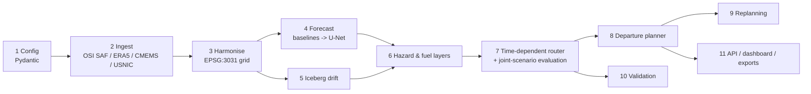

# 🧊 Antarctic Vessel Routing & Ice-Risk Forecasting System

**Uncertainty-aware route and departure planning for Antarctic voyages.** The system turns ensembles of sea-ice forecasts into a *route-level* risk estimate, then finds the cheapest route and the earliest departure date that **demonstrably** stays within a stated risk budget.

> ⚠️ **Research and decision-support prototype - not a certified navigation system.** Antarctic operations require authoritative ice information, vessel-specific operating limits, applicable ice-class guidance and qualified human oversight. All results shown below use **controlled-synthetic** data and are labelled as such in every output.

---

## ✨ What makes it different

| | Typical ice routing | This system |
|---|---|---|
| **Risk** | Per-cell probabilities multiplied as if independent | Each route is *sailed through every joint scenario*, so P(breach) respects spatial/temporal correlation |
| **Safety claim** | "P = 3%, looks fine" | A route is accepted only if the **Wilson upper bound** on P(breach) is within budget, so the scenario sample must *prove* compliance |
| **Question answered** | "Which route?" | "**When** should we leave, **and** which route?" - a departure-window sweep with a pre-declared selection rule |
| **Honesty** | Always returns a route | Returns **`infeasible`** with a diagnosis (e.g. *"the destination itself is iced in 40% of scenarios"*) |
| **Provenance** | - | Every stage emits a `StageResult` with checksums and `real` / `controlled_synthetic` / `modelled` labels; missing data = `blocked`, never faked |

---

## 📸 Demo (controlled-synthetic data)

**Departure-window planner.** The ice edge retreats through December. Dates before 20 Dec fail the 5% budget (red), and the planner selects the **earliest date that demonstrably passes** (green line).


| Feasible departure (20 Dec) | Infeasible departure (8 Dec) |
|---|---|
|  |  |
| Recommended route (red), P(breach) 1.5%, 95% upper bound 4.3% ≤ 5% | All candidates 40% - the **destination itself** is iced; no route can help, so the planner says so |

Background: probability that ice concentration exceeds the vessel limit. Geography is a **schematic** Drake Passage → Bransfield Strait world (Tierra del Fuego, South Shetland Islands, Antarctic Peninsula), not a navigational coastline.

---

## 🚀 Quickstart

```bash
git clone https://github.com/ryanshaon/antarctic-routing && cd antarctic-routing
python -m pip install -e ".[dev]"

antroute validate-config                         # check config/config.yaml
antroute demo --departure 2026-12-20             # -> artifacts/demo/
antroute departures --start 2026-11-20 --end 2027-01-10 --step-days 3
python -m pytest                                 # 132 tests
```

`antroute demo` writes `plan.json` (all candidates + explanation), `route_map.png`, `recommended_route.geojson` / `.csv` (with disclaimer, issue time, config SHA-256) and a provenance `stage-result.json`.

---

## 🧭 Pipeline and status



| Stage | Status | Module |
|---|---|---|
| 1 Scope & config | ✅ Validated config, Wilson scenario-count guard | `config.py` |
| 2 Ingestion | ✅ Resumable, checksummed, `blocked` on missing credentials · ⏳ not yet run against live services | `ingestion/` |
| 3 Harmonisation | ✅ Regridding, vector rotation, area-mean, imputation mask, season-aware climatology | `preprocessing/` |
| 4 Sea-ice forecast | ✅ Persistence / climatology / damped-anomaly baselines · ⏳ U-Net | `forecasting/` |
| 5 Iceberg drift | ⏳ Phase 2 (USNIC importer ready) | `ingestion/icebergs.py` |
| 6 Hazard & fuel | ✅ | `routing/hazard.py`, `routing/fuel.py` |
| 7 Route optimisation | ✅ Time-dependent A*, candidates, risk-budgeted selection | `routing/` |
| 8 Departure planner | ✅ Window sweep + selection rule · ⏳ trust horizon, beyond-horizon climatology scenarios | `routing/departure.py` |
| 9 Replanning | ⏳ Phase 3 | - |
| 10 Validation | ✅ MAE/RMSE/Brier/reliability · ⏳ historical replay | `validation/` |
| 11 Product | ✅ CLI, GeoJSON/CSV, figures · ⏳ FastAPI, dashboard | `cli.py`, `export.py`, `viz.py` |

---

## 📐 Core formulas

| Quantity | Formula |
|---|---|
| Speed | v<sub>km/h</sub> = 1.852 · v<sub>kn</sub>; in ice v<sub>s</sub> = max(v<sub>cruise</sub>(1 − kC), v<sub>min</sub>); ground v<sub>g</sub> = v<sub>s</sub> + u<sub>∥</sub> (impassable if ≤ 0) |
| Anomaly / damped persistence | A = C − μ(d); Ĉ<sub>t+h</sub> = clip(μ(d<sub>t+h</sub>) + ρ<sup>h</sup>A<sub>t</sub>, 0, 1), ρ fitted on training seasons |
| Threshold probability | p̂ = (1/K) Σ<sub>k</sub> 1[C<sup>(k)</sup> ≥ τ<sub>v</sub>] |
| Fuel index | c = d [1 + λ g(C)], g = C² (or piecewise, steep above τ<sub>v</sub>) |
| Search edge cost | w<sub>D</sub>d + w<sub>T</sub>Δt + w<sub>F</sub>c − w<sub>R</sub> ln(1 − p<sub>haz</sub>) (additive risk *guidance* only) |
| **Route risk** | P̂(B<sub>R</sub>) = (1/K) Σ<sub>k</sub> 1[route R breaches in scenario k] (joint, not a product of cells) |
| **Selection** | min<sub>R</sub> E[F<sub>R</sub>] s.t. Wilson-UB<sub>95%</sub>(P̂(B<sub>R</sub>)) ≤ r<sub>max</sub> |
| Scenario count | zero breaches certify r<sub>max</sub> only if n ≥ z²(1 − r)/r → **≥ 73 scenarios for 5%** (config rejects fewer) |
| Verification | MAE, RMSE, Brier = mean (p − o)², reliability bins |

---

## 🗂️ Repository layout

```
config/config.yaml          scenario: region, route, vessel, risk budget (illustrative values)
docs/ASSUMPTIONS.md         every assumption, its status and what replaces it
src/antarctic_routing/
  config.py                 Stage 1 - Pydantic validation, Wilson bound
  common/provenance.py      StageResult envelope, SHA-256, atomic JSON
  ingestion/                Stage 2 - OSI SAF, ERA5 (cdsapi), CMEMS (copernicusmarine), USNIC
  preprocessing/            Stage 3 - EPSG:3031 grid, regridding, climatology, splits
  forecasting/baselines.py  Stage 4 - persistence, climatology, damped anomaly
  synthetic.py              controlled-synthetic joint scenarios (schematic world)
  routing/                  Stages 6-8 - hazard, fuel, graph, A*, evaluation, candidates, departures
  validation/metrics.py     Stage 10 - MAE, RMSE, Brier, reliability
  export.py, viz.py, cli.py GeoJSON/CSV, figures, `antroute` CLI
tests/                      132 tests: hand-calculated values, behavioural routing worlds, leakage checks
```

---

## 🔬 Engineering notes that matter

- **Vector rotation.** In EPSG:3031, east/north wind and current components must be rotated by longitude before use as grid x/y. This is tested against pyproj finite differences.
- **Distances.** EPSG:3031 is true-scale only at 71°S, so a "10 km" cell spans ~9.5 km at 60°S. All edge lengths are geodesic (WGS84).
- **No corner-cutting.** 16-connected moves are valid only if every crossed cell is navigable.
- **Leakage.** Climatology, normalisation and ρ use training seasons only. Seasons span New Year (Nov-Feb) and are labelled by start year.
- **Missing data is hazardous.** NaN concentration on an ocean cell is treated as ice, never as open water.

---

## 🛣️ Roadmap

1. **Phase 1 (done here):** config, ingestion framework, harmonisation, baselines, hazard/fuel, router, departure sweep, exports.
2. **Phase 2:** real OSI SAF/ERA5/CMEMS pipeline run, U-Net forecast vs baselines per lead time, calibrated probabilities (isotonic/logistic on validation seasons), physics iceberg drift (dx/dt = u<sub>o</sub> + αu<sub>a</sub>) with drift ensembles.
3. **Phase 3:** climatology-anomaly scenarios beyond the forecast horizon, trust horizon (year-blocked bootstrap of skill vs baselines), voyage replanning and replay.
4. **Phase 4:** historical replay backtests vs shortest-path and fixed ice-edge-buffer baselines, fuel-sensitivity analysis, FastAPI + polar web map (OpenLayers, EPSG:3031), Docker.

## 📚 Related work

- **PolarRoute / MeshiPhi** (British Antarctic Survey): open-source polar route planning on adaptive meshes.
- **IceNet** (Andersson et al., 2021, *Nature Communications*): deep-learning seasonal sea-ice forecasting.

This project focuses on what sits between them: turning *forecast uncertainty* into a **certified route-level risk budget** and a **departure-date decision**.

## ⚖️ Limitations

- Results shown are **controlled-synthetic**; no real-world skill is claimed yet.
- Ingestion clients are unit-tested with injected fetchers but have **not yet been run against the live services** (the development sandbox blocks outbound access to them).
- Vessel parameters (`ice_class`, limit τ<sub>v</sub>, speed reduction, fuel λ) are **placeholders**. See [`docs/ASSUMPTIONS.md`](docs/ASSUMPTIONS.md).
- USNIC tracks only giant icebergs; small-berg encounter risk is out of scope until SAR detection is added.
