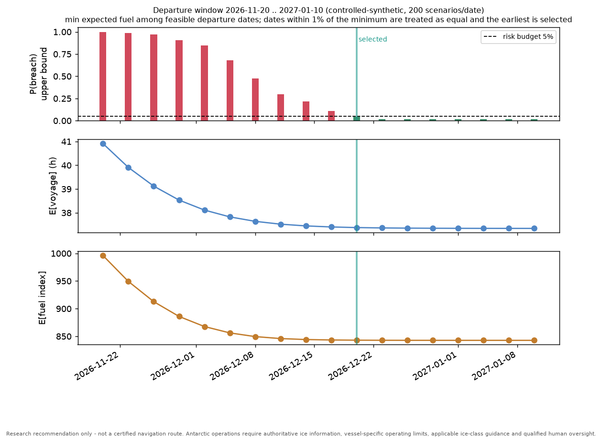
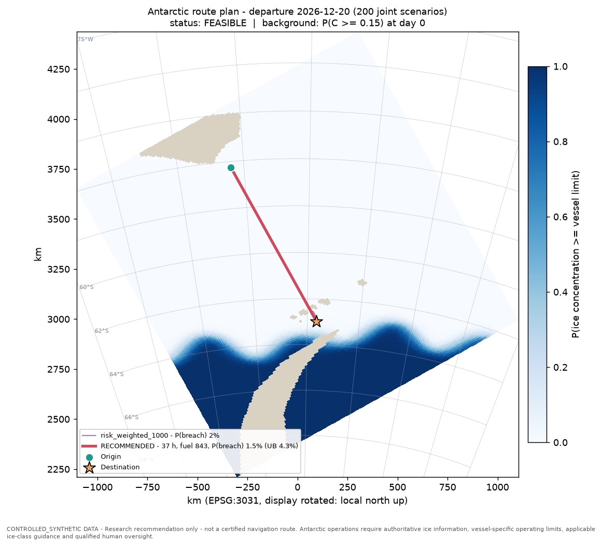
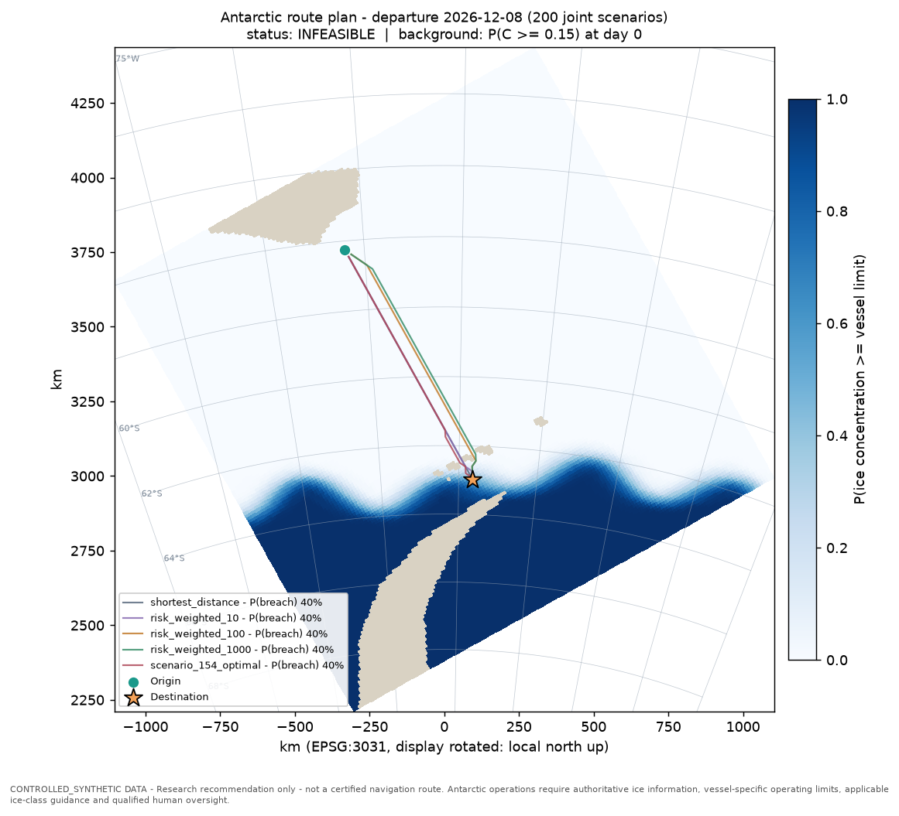
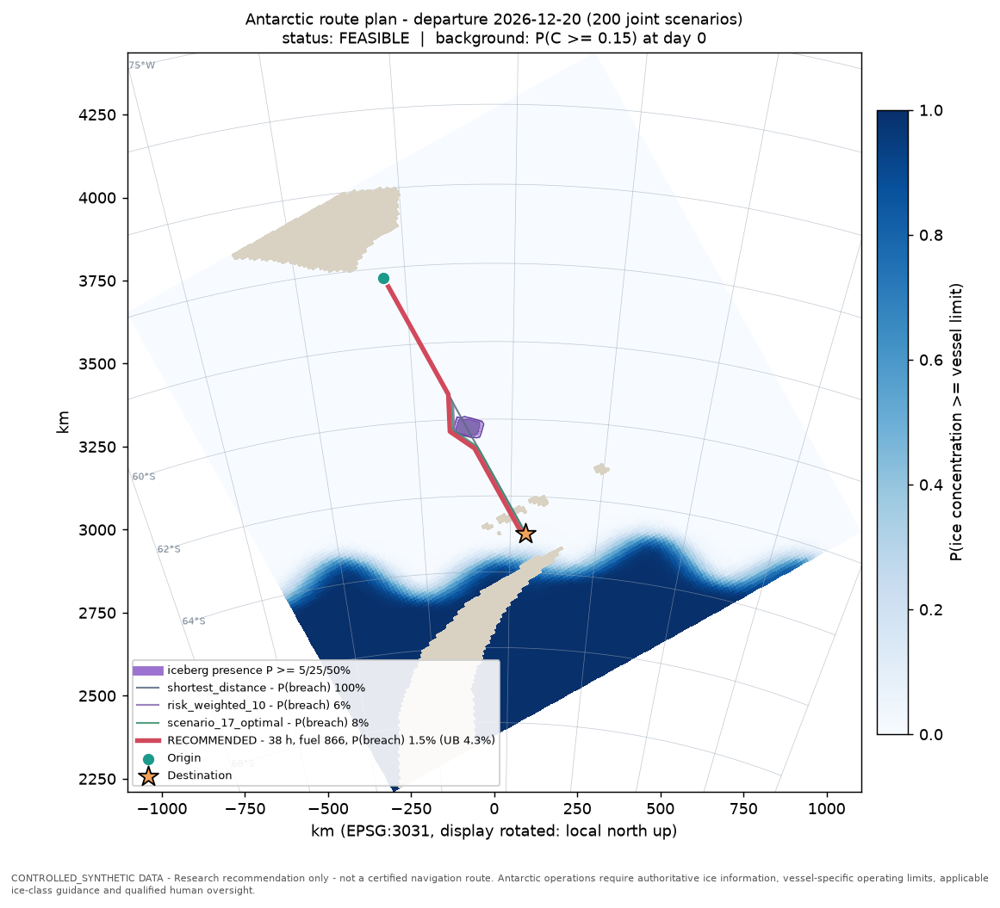
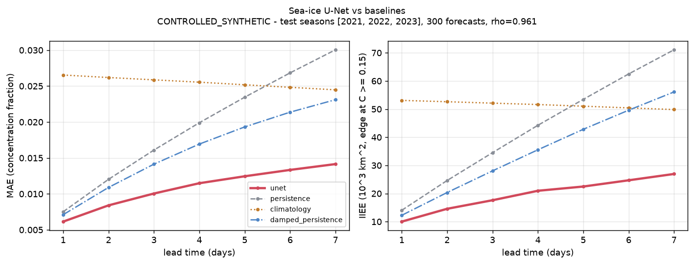
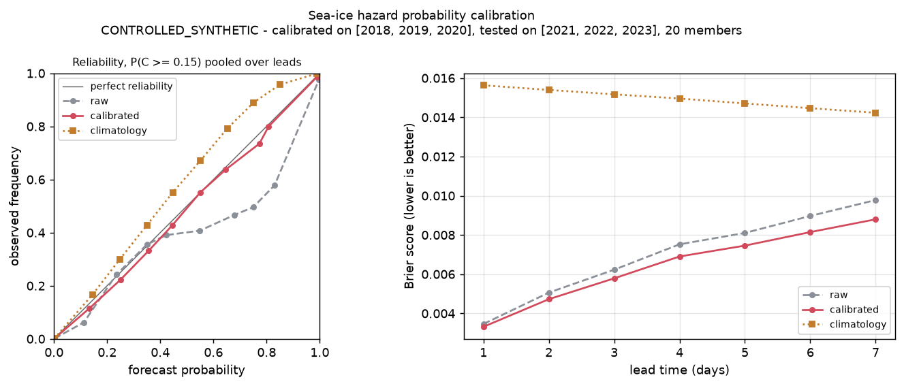
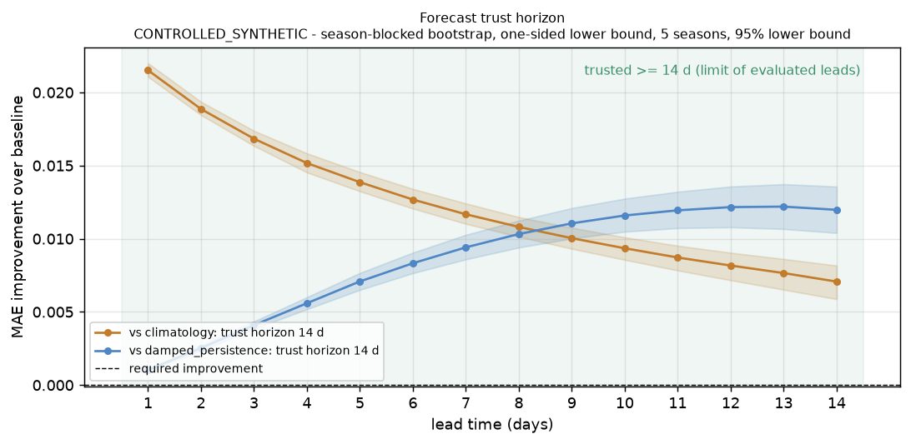
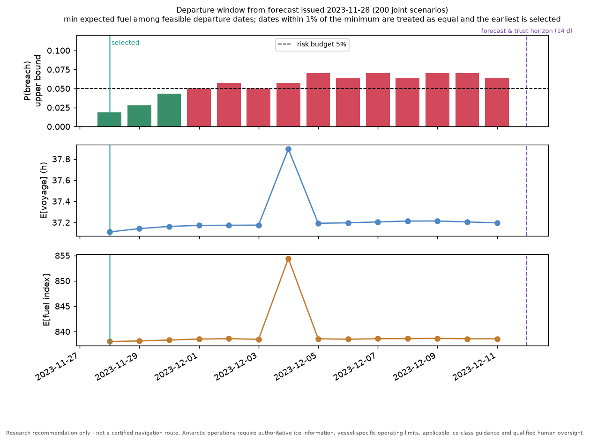
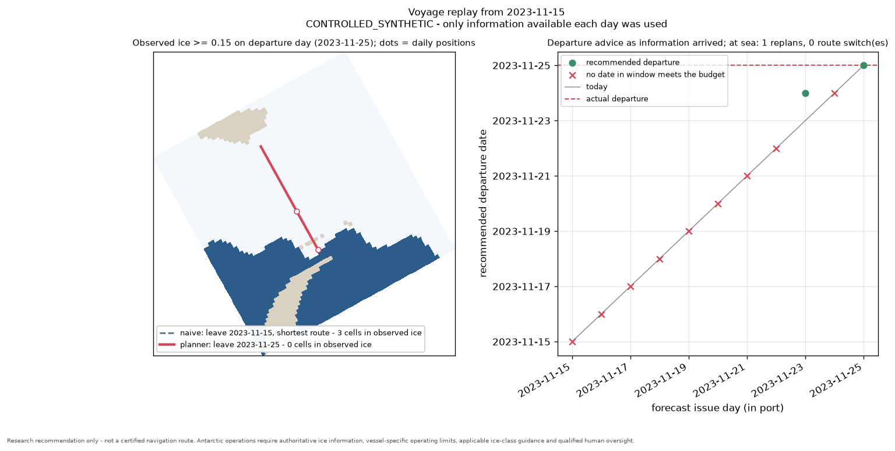
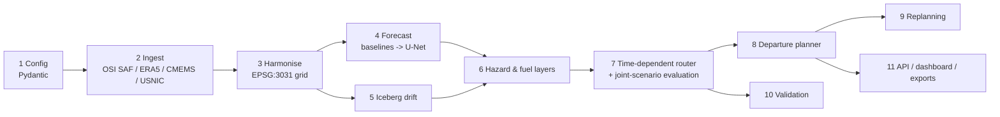

# 🧊 Antarctic Vessel Routing & Ice-Risk Forecasting System

**Uncertainty-aware route and departure planning for Antarctic voyages.** The system turns ensembles of sea-ice forecasts into a *route-level* risk estimate, then finds the cheapest route and the earliest departure date that **demonstrably** stays within a stated risk budget.

> ⚠️ **Research and decision-support prototype - not a certified navigation system.** Antarctic operations require authoritative ice information, vessel-specific operating limits, applicable ice-class guidance and qualified human oversight. All results shown below use **controlled-synthetic** data and are labelled as such in every output.

---

## ✨ What makes it different

| | Typical ice routing | This system |
|---|---|---|
| **Risk** | Per-cell probabilities multiplied as if independent | Each route is *sailed through every joint scenario*, so P(breach) respects spatial/temporal correlation |
| **Safety claim** | "P = 3%, looks fine" | A route is accepted only if the **Wilson upper bound** on P(breach) is within budget, so the scenario sample must *prove* compliance |
| **Question answered** | "Which route?" | "**When** should we leave, **and** which route?" - a departure-window sweep with a pre-declared selection rule |
| **Honesty** | Always returns a route | Returns **`infeasible`** with a diagnosis (e.g. *"the destination itself is iced in 40% of scenarios"*) |
| **Forecast** | One deterministic map | Residual U-Net (beats persistence, damped persistence and climatology at every lead 1-7 d) + **calibrated** hazard probabilities |
| **Icebergs** | Static danger zones | Physics drift ensemble (dx/dt = u<sub>o</sub> + αu<sub>a</sub>) joined to the *same* joint scenarios as sea ice |
| **Provenance** | - | Every stage emits a `StageResult` with checksums and `real` / `controlled_synthetic` / `modelled` labels; missing data = `blocked`, never faked |

---

## 📸 Demo (controlled-synthetic data)

**Departure-window planner.** The ice edge retreats through December. Dates before 20 Dec fail the 5% budget (red), and the planner selects the **earliest date that demonstrably passes** (green line).



| Feasible departure (20 Dec) | Infeasible departure (8 Dec) |
|---|---|
|  |  |
| Recommended route (red), P(breach) 1.5%, 95% upper bound 4.3% ≤ 5% | All candidates 40% - the **destination itself** is iced; no route can help, so the planner says so |

**Iceberg avoidance.** A tracked berg (purple, drift-ensemble presence) sits on the direct line. The shortest route breaches in 100% of scenarios; the recommended route detours 23 km (+1.1 h) to P(breach) 1.5% (UB 4.3%).



Background: probability that ice concentration exceeds the vessel limit. Geography is a **schematic** Drake Passage → Bransfield Strait world (Tierra del Fuego, South Shetland Islands, Antarctic Peninsula), not a navigational coastline.

---

## 🧠 Phase 2 results: forecasting and calibration (controlled-synthetic)

Trained on 14 seasons, validated on 3, tested on 3 **held-out** seasons (2021-2023), 14-day input, 1-7 day leads, 25 km grid. The synthetic history has real dynamics: a retreating edge, mean-reverting seasonal anomalies (ρ = 0.961 fitted on training seasons) and ice tongues drifting east with the current.



| Lead | **Residual U-Net** | Direct U-Net | Persistence | Damped persistence | Climatology |
|---|---|---|---|---|---|
| 1 d | **0.0061** | 0.0083 | 0.0075 | 0.0071 | 0.0265 |
| 4 d | **0.0115** | 0.0126 | 0.0199 | 0.0169 | 0.0255 |
| 7 d | **0.0141** | 0.0148 | 0.0300 | 0.0231 | 0.0245 |

MAE of concentration fraction on identical samples and ocean cells. The **direct** U-Net loses to persistence at day 1 ("a neural network is not automatically better than persistence"). Predicting the *change* from today's map (Ĉ = C<sub>t</sub> + Δ, zero-initialised head so an untrained model *is* persistence) fixes this: the residual model is 14% better than the best baseline at day 1 and 39% better at day 7, with ice-edge error (IIEE) roughly halved.



**Probabilities.** Members = forecast + whole historical error fields from training seasons, so they are coherent joint scenarios. The raw ensemble is **over-confident** (grey). Per-lead isotonic calibration fitted on validation seasons puts it on the diagonal (red) and lowers the Brier score at every lead on the test seasons. Brier skill vs climatology: 0.79 (1 d) to 0.38 (7 d).

---

## 🧭 Phase 3 results: deciding *when* to leave, and adapting at sea (controlled-synthetic)

**Forecast-driven scenarios.** A forecast issued on day *t* becomes joint scenarios: layer 0 is the observation; leads 1-14 are the U-Net plus whole training-season error sequences; beyond the forecast horizon, each member replays one training season's daily **anomaly sequence** on top of climatology (it never repeats the last forecast). A test confirms that overwriting every observation after the issue date leaves the scenarios **byte-identical**, so there is no look-ahead.

**Trust horizon.** The last lead for which the model's improvement over *both* damped persistence and climatology has a positive 95% lower bound under a **season-blocked bootstrap** (5 held-out seasons).



On this synthetic history the U-Net keeps significant skill through day 14, so the horizon is reported as **≥ 14 d (limited by the evaluated leads)**, not as a measured end point. The margin over climatology shrinks with lead (0.022 → 0.007), and real sea ice should give a much shorter horizon.

**Departure window from one forecast.** Forecast issued 28 Nov 2023 (held-out season), 200 joint scenarios, departures +0 … +13 d. Only the next three days demonstrably meet the 5% budget. Later dates get *riskier* even though the ice is retreating, because forecast uncertainty grows with lead time. The planner selects **today**.



**Replanning and replay.** Each day in port, the planner issues a forecast and plans the window; it leaves only when the selected departure is *today*. At sea, the ship advances 24 h through the **observed** ice and then replans from its position. It switches route only when the current route exceeds the budget or an alternative is materially better, and raises an alert only when the path moves more than 25 km. Every decision is appended to `audit.jsonl`.



| Replay from 15 Nov 2023 | Departs | Voyage | Fuel index | Route cells in observed ice ≥ 15% |
|---|---|---|---|---|
| Naive (leave day 1, shortest route) | 15 Nov | 38.6 h | 921 | **3** |
| **This system** | 25 Nov (advice evolved daily) | 37.1 h | **838** | **0** |

One replay on synthetic data is a demonstration, not evidence. Phase 4 repeats it across seasons and start dates. It also measures the cost of caution: in another replay, the planner waited two days when leaving on day 1 would also have been safe.

---

## 🚀 Quickstart

```bash
git clone https://github.com/ryanshaon/antarctic-routing && cd antarctic-routing
python -m pip install -e ".[dev]"

antroute validate-config                         # check config/config.yaml
antroute demo --departure 2026-12-20             # -> artifacts/demo/
antroute departures --start 2026-11-20 --end 2027-01-10 --step-days 3
antroute demo --departure 2026-12-20 --iceberg A23A:-60.2:-62.6 --berg-radius-km 15

# Phase 2: forecasting (synthetic history by default; pass --data for real data)
antroute train-forecast --resolution-km 25 --lead-days 7 --out models/unet
antroute evaluate-forecast --resolution-km 25 --weights models/unet/best.pt
antroute calibrate-forecast --resolution-km 25 --weights models/unet/best.pt

# Phase 3: trust horizon, departure window from one forecast, day-by-day replay
S="--synthetic-seasons 2002:2026 --resolution-km 25 --n-val 3 --n-test 5"
antroute train-forecast $S --lead-days 14 --out models/unet14
antroute evaluate-forecast $S --weights models/unet14/best.pt --out reports/forecast14
antroute trust-horizon --report reports/forecast14/forecast_eval.json
antroute plan-window $S --weights models/unet14/best.pt --issue 2023-11-28 --window-days 14 \
    --trust-report reports/trust/trust_horizon.json
antroute replay $S --weights models/unet14/best.pt --start 2023-11-15 --window-days 7

# Real OSI SAF data (needs network access to thredds.met.no)
antroute fetch-sea-ice --start 2024-11-01 --end 2025-02-28
antroute build-dataset --inputs "data/raw/sea_ice/**/*.nc" --out data/processed/sea_ice.nc
antroute train-forecast --data data/processed/sea_ice.nc --n-val 1 --n-test 1

python -m pytest                                 # full test suite
```

`antroute demo` writes `plan.json` (all candidates + explanation), `route_map.png`, `recommended_route.geojson` / `.csv` (with disclaimer, issue time, config SHA-256) and a provenance `stage-result.json`.

---

## 🧭 Pipeline and status



| Stage | Status | Module |
|---|---|---|
| 1 Scope & config | ✅ Validated config, Wilson scenario-count guard | `config.py` |
| 2 Ingestion | ✅ Resumable, checksummed, `blocked` on missing credentials; OSI SAF reader (own CRS from CF metadata) + dataset builder · ⏳ not yet run against live services | `ingestion/` |
| 3 Harmonisation | ✅ Regridding, vector rotation, area-mean, imputation mask, season-aware climatology | `preprocessing/` |
| 4 Sea-ice forecast | ✅ Baselines, residual U-Net, per-lead MAE/RMSE/IIEE evaluation, residual-bootstrap ensembles, isotonic calibration | `forecasting/` |
| 5 Iceberg drift | ✅ RK2 physics with projection scale factor, ensembles, presence layers joined to route risk, learned correction validated on held-out icebergs | `iceberg/drift.py` |
| 6 Hazard & fuel | ✅ | `routing/hazard.py`, `routing/fuel.py` |
| 7 Route optimisation | ✅ Time-dependent A*, candidates, risk-budgeted selection | `routing/` |
| 8 Departure planner | ✅ Forecast-driven joint scenarios, climatology-anomaly scenarios beyond the horizon, trust horizon, window from one issue with support/trust flags | `forecasting/scenarios.py`, `forecasting/trust.py`, `routing/departure.py` |
| 9 Replanning | ✅ Triggers, hysteresis, corridor alerts, stale-input flag, JSONL audit log, day-by-day replay | `routing/replan.py`, `replay.py` |
| 10 Validation | ✅ MAE/RMSE/IIEE/Brier/reliability, single-voyage replay vs naive · ⏳ multi-season replay backtest | `validation/`, `replay.py` |
| 11 Product | ✅ CLI, GeoJSON/CSV, figures · ⏳ FastAPI, dashboard | `cli.py`, `export.py`, `viz.py` |

---

## 📐 Core formulas

| Quantity | Formula |
|---|---|
| Speed | v<sub>km/h</sub> = 1.852 · v<sub>kn</sub>; in ice v<sub>s</sub> = max(v<sub>cruise</sub>(1 − kC), v<sub>min</sub>); ground v<sub>g</sub> = v<sub>s</sub> + u<sub>∥</sub> (impassable if ≤ 0) |
| Anomaly / damped persistence | A = C − μ(d); Ĉ<sub>t+h</sub> = clip(μ(d<sub>t+h</sub>) + ρ<sup>h</sup>A<sub>t</sub>, 0, 1), ρ fitted on training seasons |
| Threshold probability | p̂ = (1/K) Σ<sub>k</sub> 1[C<sup>(k)</sup> ≥ τ<sub>v</sub>] |
| Fuel index | c = d [1 + λ g(C)], g = C² (or piecewise, steep above τ<sub>v</sub>) |
| Search edge cost | w<sub>D</sub>d + w<sub>T</sub>Δt + w<sub>F</sub>c − w<sub>R</sub> ln(1 − p<sub>haz</sub>) (additive risk *guidance* only) |
| **Route risk** | P̂(B<sub>R</sub>) = (1/K) Σ<sub>k</sub> 1[route R breaches in scenario k] (joint, not a product of cells) |
| **Selection** | min<sub>R</sub> E[F<sub>R</sub>] s.t. Wilson-UB<sub>95%</sub>(P̂(B<sub>R</sub>)) ≤ r<sub>max</sub> |
| Scenario count | zero breaches certify r<sub>max</sub> only if n ≥ z²(1 − r)/r → **≥ 73 scenarios for 5%** (config rejects fewer) |
| Verification | MAE, RMSE, Brier = mean (p − o)², reliability bins |

---

## 🗂️ Repository layout

```
config/config.yaml          scenario: region, route, vessel, risk budget (illustrative values)
docs/ASSUMPTIONS.md         every assumption, its status and what replaces it
src/antarctic_routing/
  config.py                 Stage 1 - Pydantic validation, Wilson bound
  common/provenance.py      StageResult envelope, SHA-256, atomic JSON
  ingestion/                Stage 2 - OSI SAF, ERA5 (cdsapi), CMEMS (copernicusmarine), USNIC
  preprocessing/            Stage 3 - EPSG:3031 grid, regridding, climatology, splits
  forecasting/              Stage 4 - baselines, U-Net, training, per-lead evaluation, calibration
  iceberg/drift.py          Stage 5 - drift physics, ensembles, presence layers, learned correction
  forecasting/scenarios.py  Stage 8 - forecast-issued joint scenarios (observed / forecast / climatology layers)
  forecasting/trust.py      Stage 8 - trust horizon (season-blocked bootstrap)
  routing/replan.py         Stage 9 - replanning triggers, hysteresis, audit log
  replay.py                 Stage 9/10 - day-by-day historical replay scored against observed ice
  synthetic.py              controlled-synthetic joint scenarios (schematic world)
  routing/                  Stages 6-8 - hazard, fuel, graph, A*, evaluation, candidates, departures
  validation/metrics.py     Stage 10 - MAE, RMSE, Brier, reliability
  export.py, viz.py, cli.py GeoJSON/CSV, figures, `antroute` CLI
tests/                      hand-calculated values, behavioural routing worlds, leakage and split checks
```

---

## 🔬 Engineering notes that matter

- **Vector rotation.** In EPSG:3031, east/north wind and current components must be rotated by longitude before use as grid x/y. This is tested against pyproj finite differences.
- **Distances.** EPSG:3031 is true-scale only at 71°S, so a "10 km" cell spans ~9.5 km at 60°S. All edge lengths are geodesic (WGS84).
- **No corner-cutting.** 16-connected moves are valid only if every crossed cell is navigable.
- **Leakage.** Climatology, normalisation and ρ use training seasons only. Seasons span New Year (Nov-Feb) and are labelled by start year.
- **Missing data is hazardous.** NaN concentration on an ocean cell is treated as ice, never as open water.
- **OSI SAF is not EPSG:3031.** OSI-401-b uses its own stereographic grid (true scale 70°S, Hughes ellipsoid, km). The reader takes the CRS from the file's CF metadata.
- **Iceberg drift on a map.** Velocities are ground speeds; a conformal projection moves a point at k·v, where k is the point scale factor. This is tested against geodesic distance (0.25 m/s × 6 h = 5.4 km).
- **No leakage across icebergs.** The learned drift correction is validated with whole icebergs held out.

---

## 🛣️ Roadmap

1. **Phase 1 ✅** config, ingestion framework, harmonisation, baselines, hazard/fuel, router, departure sweep, exports.
2. **Phase 2 ✅** OSI SAF reader, residual U-Net vs baselines per lead, calibrated probabilities, iceberg drift ensembles in route risk. *Pending:* first run on real OSI SAF/ERA5/CMEMS data.
3. **Phase 3 ✅** U-Net ensembles drive the router, climatology-anomaly scenarios beyond the horizon, trust horizon (season-blocked bootstrap), departure window from one forecast issue, replanning with an audit log, day-by-day replay.
4. **Phase 4:** historical replay backtests vs shortest-path and fixed ice-edge-buffer baselines, fuel-sensitivity analysis, FastAPI + polar web map (OpenLayers, EPSG:3031), Docker.

## 📚 Related work

- **PolarRoute / MeshiPhi** (British Antarctic Survey): open-source polar route planning on adaptive meshes.
- **IceNet** (Andersson et al., 2021, *Nature Communications*): deep-learning seasonal sea-ice forecasting.

This project focuses on what sits between them: turning *forecast uncertainty* into a **certified route-level risk budget** and a **departure-date decision**.

## ⚖️ Limitations

- Results shown are **controlled-synthetic**; no real-world skill is claimed yet. Synthetic dynamics are simpler than real sea ice, so real-data skill margins will be smaller.
- Ingestion clients are unit-tested with injected fetchers but have **not yet been run against the live services** (the development sandbox blocks outbound access to them).
- Vessel parameters (`ice_class`, limit τ<sub>v</sub>, speed reduction, fuel λ) are **placeholders**. See [`docs/ASSUMPTIONS.md`](docs/ASSUMPTIONS.md).
- USNIC tracks only giant icebergs; small-berg encounter risk is out of scope until SAR detection is added.
